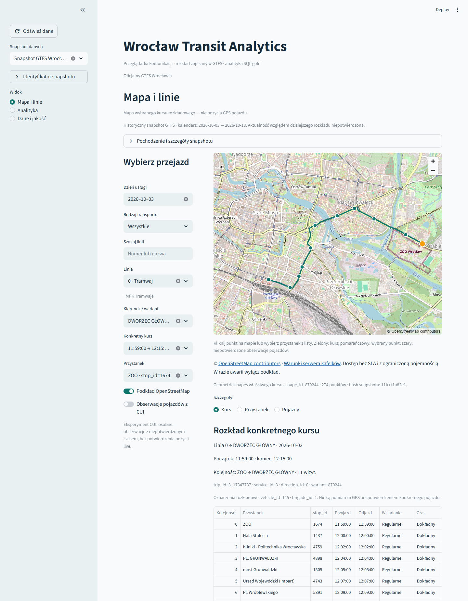

# Wrocław Transit Analytics

Lokalna przeglądarka rozkładu komunikacji Wrocławia: mapa ulic i przebiegu kursu,
linie, kierunki, konkretne kursy i rozkładowe odjazdy z przystanków. Python przygotowuje
zweryfikowane GTFS, PostgreSQL liczy analitykę SQL, a Streamlit udostępnia oba widoki.



Ekran przedstawia rzeczywiste ulice OpenStreetMap i historyczny snapshot GTFS,
**nie aktualne położenie pojazdu GPS**. Demo syntetyczne jest osobno oznaczone w aplikacji.

## Uruchomienie aktualnej aplikacji

Wymagany działający lokalny Docker i Compose. W PowerShell, z katalogu repozytorium:

```powershell
& .\scripts\start-explorer.ps1
```

To start/restart istniejącego projektu `wta-explorer`: dashboard **8502**, PostgreSQL
**5434**, istniejąca `.env.demo` i trwałe wolumeny. Skrypt buduje aktualny dashboard,
sprawdza gotowość i wypisuje rzeczywisty adres. Po udanym starcie otwórz
**http://127.0.0.1:8502**. Zwykły restart nie pobiera GTFS i nie importuje ponownie danych.
Stare demo `wta-demo` na 8501/5433 pozostaje oddzielne.

Świeże demo, także z czystego checkoutu bez lokalnych danych autora:

```powershell
& .\scripts\start-explorer.ps1 -Demo -ProjectName wta-explorer-demo -DashboardPort 8503 -PostgresPort 5436
```

Skrypt tworzy własną konfigurację projektu tylko przy pierwszym starcie, uruchamia
bazę, migracje i istniejący pipeline demo, a następnie dashboard. Powtórzenie zachowuje
hasła i dane. To **dane syntetyczne, nie rozkład Wrocławia**. Porty można zmienić
parametrami; skrypt nie zatrzymuje cudzych procesów. Adres wypisuje dopiero po gotowości.

Rzeczywiste dane wybierz jawnie: istniejący raw manifest albo konkretny oficjalny ZIP.
Przykład bez ponownego pobierania:

```powershell
& .\scripts\start-explorer.ps1 -RawManifest 'C:\dane GTFS\raw\manifest.json' -StartDate 2026-10-03 -EndDate 2026-10-09
```

Skrypt przekazuje faktyczne wyniki prepare/load/analytics do dalszych etapów i importu
shapes. Nie wymaga przepisywania dataset_id, hashy ani wygenerowanych katalogów.
Nie wybiera automatycznie „najnowszego” pliku. [Źródła, parametry i polityka PowerShell](docs/transit-explorer.md).

## Gdzie kliknąć

1. Wybierz snapshot w panelu bocznym. Pierwszy ekran to **Mapa i linie**.
2. Wybierz dzień usługi, rodzaj komunikacji i linię; następnie kierunek/wariant i kurs.
3. Mapa pokazuje shapes wybranego kursu oraz jego przystanki. Kliknięcie punktu
   otwiera odjazdy; ten sam punkt można wybrać z listy **Przystanek**.
4. Szczegóły **Kurs** zawierają kolejność wizyt, godziny i zasady wsiadania.
   **Przystanek** pokazuje rozkładowe odjazdy wybranej linii w tym dniu.
5. **Analityka** pokazuje SQL KPI i szczegóły linii/punktu; **Dane i jakość** —
   pochodzenie, pokrycie kalendarza i wyniki walidacji.

Zmiana snapshotu resetuje zależne wybory. Godziny ponad 24:00 zachowują dzień usługi;
brak czasu nie staje się północą. Oznaczenia „Dokładny” i „Przybliżony” pochodzą z GTFS.
Lista, szczegóły i własna geometria działają również przy wyłączonym podkładzie.

## Przepływ i ograniczenia

**Oficjalny ZIP lub generator demo → raw → bronze/silver Parquet i kontrola jakości
→ PostgreSQL → SQL gold / explorer → Streamlit.** Manifesty, hashe i izolacja datasetów
zapewniają odtwarzalność; loader i analityka są transakcyjne i idempotentne.
Dashboard używa osobnego użytkownika `wta_reader` bez praw zapisu.

Lokalny oficjalny snapshot pobrano 2026-10-04; jego kalendarz obejmuje
2026-10-03–2026-10-18. Nie potwierdzono zgodności tego archiwum z dzisiejszym rozkładem.
Brak shapes daje przystanki bez udawanej prostej trasy. Brak usługi w poprawnym dniu
i data poza zakresem danych mają odrębne komunikaty.

**Live GPS nie należy do ukończonych funkcji.** Eksperymentalne obserwacje CUI są
domyślnie wyłączone, szare i oddzielone od rozkładu. Ich czas i warunki użycia pozostają
niepotwierdzone; nie są łączone z trip_id. Punktualność, pasażerowie, predykcje,
planowanie przesiadek i chmura pozostają poza wydaniem 0.2.0.

Kod: [MIT](LICENSE). GTFS: CC0 1.0 według [oficjalnych metadanych](https://open-data.cui.wroclaw.pl/hdb/metadane/13/)
odczytanych 2026-10-07. Podkład: [atrybucja OpenStreetMap](https://www.openstreetmap.org/copyright)
i [Tile Usage Policy](https://operations.osmfoundation.org/policies/tiles/), bez masowego pobierania
i gwarancji dostępności. Warunki obserwacji CUI nie są potwierdzonymi warunkami GTFS.

## Rozwój i sprawdzenie

Python 3.12, Pandas, PyArrow, HTTPX, Psycopg, PostgreSQL 17, Streamlit 1.57/Pydeck,
Docker Compose, pytest, Ruff i GitHub Actions. Instalacja dla dewelopera:

```powershell
py -V:3.12 -m venv .venv
.\.venv\Scripts\python.exe -m pip install -c constraints.txt -e ".[dev,dashboard,ui-test]"
.\.venv\Scripts\ruff.exe check .
.\.venv\Scripts\ruff.exe format --check .
.\.venv\Scripts\python.exe -m pytest -m "not integration and not browser"
```

Offline nie wymaga publicznego GTFS ani kafelków. CI dodatkowo uruchamia prawdziwy
PostgreSQL i Compose/Chromium, w tym obowiązkową regresję przełączania dwóch
syntetycznych snapshotów o rozłącznych kalendarzach. Publiczne kafelki są w testach
blokowane lub zastępowane jawnie syntetycznym rastrem. Lokalny odbiór rzeczywistego
snapshotu i ulic jest osobnym dowodem. Wyniki dotyczą konkretnych testowanych SHA.

[Przeglądarka i starter](docs/transit-explorer.md) · [Dashboard i reader](docs/dashboard.md)
· [Studium portfolio i SELECT](docs/portfolio-case-study.md) · [Wydanie 0.2.0](docs/release-notes-v0.2.0.md)
· [Zakres](docs/project-scope.md) · [Stan implementacji](docs/project-plan.md)
· [Kontrakt danych](docs/data-contract.md) · [Definicje KPI](docs/metrics.md).

Autor: Jonatan Tomaszewicz.
