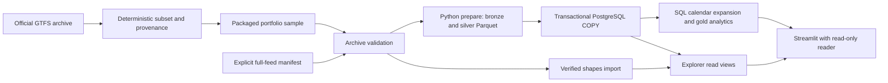

# Wrocław Transit Analytics

Explore Wrocław's scheduled tram and bus journeys on a map, then inspect the SQL analytics behind them.

[](https://github.com/playson92/wroclaw-transit-analytics/actions/workflows/ci.yml?query=branch%3Afeat%2Fportfolio-polish)
[Polska instrukcja](README.pl.md) · [Code tour](#code-tour-and-tests) · [MIT](LICENSE)


The screenshot shows the running application with a **small, archived GTFS sample**. It is a timetable explorer, not an official city product or live vehicle tracker. The interface is in Polish.

## Explore the application

- **Mapa i kursy:** search a line, choose a service day, direction and journey, inspect its actual GTFS shape, and select a stop on the map or from the list.
- **Journey details:** read every stop visit in order, including repeated visits and times after midnight; open the complete source-oriented table when needed.
- **Stop departures:** inspect the selected line's scheduled departures and boarding rules, with exact, approximate and missing times distinguished.
- **Analityka:** compare scheduled trip instances, regular known departures, active lines and served stop IDs within an explicit analysis period.
- **Dane / O projekcie:** inspect the source, calendar coverage, validation and implementation decisions without losing the current journey selection.

[Watch a short recording of the real application](docs/assets/portfolio-demo.webm). The map's geometry and timetable are local; the optional street background uses OpenStreetMap.

## Quick start from a fresh download

[Download the portfolio-review branch as a public ZIP](https://github.com/playson92/wroclaw-transit-analytics/archive/refs/heads/feat/portfolio-polish.zip), extract it, and open a terminal in the extracted repository directory. No GitHub account or Git installation is required. Git users can clone the same `feat/portfolio-polish` branch.

With your **local Linux Docker engine running**, execute this command in PowerShell, CMD, Linux or macOS:

```text
docker compose -f compose.demo.yaml up --build -d --wait
```

Open **[http://127.0.0.1:8504](http://127.0.0.1:8504)** after the command succeeds. The first build takes longer because it downloads images and Python packages.

Compose prepares persistent credentials, starts PostgreSQL, applies migrations and role grants, validates and loads the packaged sample, imports its geometry, calculates SQL analytics, and starts the dashboard after those steps succeed. You do not need host Python, PostgreSQL, API keys, a `.env` file, or pre-existing data directories.

The demo is a separate `wta-portfolio` project. PostgreSQL has no published host port; the dashboard listens only on `127.0.0.1`. Existing projects are not part of this command.

To stop while keeping credentials and data:

```text
docker compose -f compose.demo.yaml stop
```

To start again, repeat the quick-start command; this also preserves startup ordering. To restart only the already running database and dashboard:

```text
docker compose -f compose.demo.yaml restart postgres dashboard
docker compose -f compose.demo.yaml up -d --wait
```

The second command waits for healthy services. A whole-project `restart` is unnecessary: configuration, migration and sample services are one-off stages whose dependencies are enforced by `up`. Repeated startup and the scoped restart preserve passwords and dataset identity. Do not use `down -v` or `prune` to restart this demo. A database whose corresponding credential configuration is missing produces an error rather than silently generating replacement passwords.

If 8504 is occupied, set `WTA_DEMO_PORT` for your terminal session, then run the same command:

| Shell | Example port override |
| --- | --- |
| PowerShell | `$env:WTA_DEMO_PORT = '8514'` |
| CMD | `set WTA_DEMO_PORT=8514` |
| Linux / macOS | `export WTA_DEMO_PORT=8514` |

The resulting address is `http://127.0.0.1:8514`. Port overrides do not stop another application.

## Requirements and platform evidence

- Docker Desktop with Linux containers, or a local Linux Docker Engine; Docker Engine 24+ and Compose 2.20+ are the supported baseline.
- A current desktop browser. No GPU, cloud account or host Python is required for the demo.
- Internet for the **first image/package build**. Repeating the demo uses the packaged timetable and persistent local data; it does not download GTFS or query a city API.
- Internet for the **optional OpenStreetMap background**. Disabling it, or a tile-provider failure, leaves journey geometry, stops and tables available. This is not an offline package of OSM tiles.
- A free loopback dashboard port; 8504 by default.

Both `linux/amd64` and `linux/arm64` use the same Dockerfile and dependency constraints. The Compose file does not force an architecture. A successful build alone is not an end-to-end platform test.

| Host / runner | Container architecture | Verification | Result / limitation |
| --- | --- | --- | --- |
| Windows + Docker Desktop | Linux AMD64 | Exact-commit export without Git metadata, local environment or author data, in a path with spaces; first start, repeat, scoped restart, SQL and Edge browser | **PASS:** sample, analysis, geometry, KPIs and credentials preserved; actual browser verification |
| GitHub Actions, Ubuntu | Linux AMD64, native | Full native Compose demo and browser job | Commit-specific result in linked CI; required runtime check |
| GitHub Actions, Ubuntu ARM runner | Linux ARM64, native | Image, native imports, preparation and full native Compose/browser job | Commit-specific result in linked CI; required runtime check |
| macOS / Apple Silicon | Linux ARM64 intended | No physical macOS environment available | **Not tested on macOS**; Linux ARM64 evidence is not a macOS test |

[CI runs](https://github.com/playson92/wroclaw-transit-analytics/actions/workflows/ci.yml) publish JUnit, screenshots and the tested source SHA. Local visual acceptance additionally checks 1440×900, 1366×768, 1024 px and approximately 390 px layouts.

## Architecture



Demo startup uses the same parser, validation, loader, analytics and geometry importer as the full-data mode. `compose.demo.yaml` adds orchestration and packaged inputs; it does not contain a second analytics implementation or hardcoded KPI values. [Data contract](docs/data-contract.md) · [KPI definitions](docs/metrics.md) · [Database runtime](docs/postgres-runtime.md).

## Technical decisions

- **Traceable datasets:** source bytes and manifests are hashed. Dataset identity depends on the archive hash and model version; analyses additionally identify an explicit date range and metrics version. Full feeds and the derivative sample remain separate datasets.
- **Bounded preparation:** strict CSV parsing preserves textual IDs such as `0001` and `NA`. Batch Parquet writing and global quality checks avoid concatenating every stop visit into memory.
- **Transactional publication:** the loader validates file/schema/content fingerprints before batched `COPY`. Foreign keys, advisory locks and transactions prevent partial or duplicate dataset publication. Repeating a matching load is idempotent.
- **SQL owns the calendar and metrics:** weekly service and date exceptions expand into service days before aggregation. Distinct lines are counted across the chosen period; daily distinct counts and medians are not averaged into misleading totals.
- **Times retain their meaning:** `24:10` belongs to the original service day. Missing time stays missing; no midnight replacement, interpolation or GPS animation is invented. Unknown coverage is `NULL`, distinct from a covered day with zero service.
- **Least-privilege reads:** the dashboard runs as a non-root OS user and a separate `wta_reader` database role. Read-only transactions and grants are verified independently; the browser receives no administrator credentials.
- **Explicit state and map fallback:** dataset changes reset dependent day/line/variant/journey/stop choices; page changes preserve the current dataset's context. The map uses the selected journey's source geometry. Missing shapes show points without inventing a road route.

The backend is Python 3.12, Pandas, PyArrow, HTTPX, Psycopg and PostgreSQL 17. Presentation uses Streamlit 1.57 and Pydeck with shared theme/components. Docker Compose, pytest, Ruff, Playwright and GitHub Actions provide repeatable execution and verification.

## Code tour and tests

| Start here | What to inspect |
| --- | --- |
| [Ingestion](src/wroclaw_transit_analytics/gtfs/ingestion.py), [archive validation](src/wroclaw_transit_analytics/gtfs/validation.py) | Bounded official-source downloads, ZIP integrity, admission and manifests |
| [Preparation](src/wroclaw_transit_analytics/preparation/pipeline.py), [quality checks](src/wroclaw_transit_analytics/preparation/quality.py) | Strict IDs/types/times, batched Parquet, cross-table consistency and source provenance |
| [Transactional loader](src/wroclaw_transit_analytics/database/loader.py), [roles](src/wroclaw_transit_analytics/database/roles.py) | Fingerprints, batched COPY, dataset isolation and ACLs |
| [Service calendar SQL](src/wroclaw_transit_analytics/analytics/sql/services.sql), [analytics runner](src/wroclaw_transit_analytics/analytics/runner.py) | Weekly calendar plus exceptions, explicit analysis ranges and versioned gold output |
| [Explorer queries](src/wroclaw_transit_analytics/explorer/data.py), [geometry](src/wroclaw_transit_analytics/explorer/geometry.py), [UI](src/wroclaw_transit_analytics/explorer/ui.py) | Selected-day journeys, ordered visits, verified shapes and filter state |
| [Dashboard](src/wroclaw_transit_analytics/dashboard/ui.py), [reader queries](src/wroclaw_transit_analytics/dashboard/data.py) | Presentation separated from SQL and read-only access |
| [Regression scenarios](tests/analytics/scenarios.py), [PostgreSQL tests](tests/database/test_postgres.py), [snapshot browser regression](tests/ui/test_snapshot_browser.py) | Hand-checked metrics, rollback/ACL/isolation and two disjoint calendar snapshots |
| [Raster browser test](tests/ui/test_raster_browser.py), [starter tests](tests/starter/test_explorer_starter.py) | Local tile fixture, marker selection, fallback and safe restarts |

For contributors, install Python **3.12** and the pinned development extras in a virtual environment:

```text
python -m pip install -c constraints.txt -e ".[dev,dashboard,ui-test]"
python -m ruff check .
python -m ruff format --check .
python -m pytest -m "not integration and not browser"
```

These are development commands, not demo prerequisites. [CONTRIBUTING](CONTRIBUTING.md) explains PostgreSQL and browser tests. CI runs the offline suite, actual PostgreSQL, Compose/browser regressions and portable demo checks. Ordinary map tests block public tiles or use an explicitly synthetic local raster; they do not scan public map servers.

The separate D1/D2 synthetic fixture remains **16 trip instances / 25 regular known departures / 2 active lines / 3 served stop IDs** for 2026-10-01–2026-10-07. It tests the calculation contract; it is not the portfolio sample or Wrocław's complete network. [Full-feed exploration and existing starters](docs/transit-explorer.md) · [SQL case study of the full archive](docs/portfolio-case-study.md).

## Sample, limitations and licenses

The portfolio sample is a **derivative of an archived official GTFS**, not a newly downloaded original feed. It contains **tram lines 1 and 10, bus lines 100 and 106**, all their original journeys/visits, referenced geometries, agencies, services and stops (including parent references). It is approximately **526 KiB** and contains 4 routes, 2,036 trip templates, 53,743 stop visits, 282 stop records and 13,537 shape points. Static trip templates are not the number of journeys active on a particular day.

The original archive was downloaded on **2026-10-04T21:11:22.391308Z**; its calendar envelope is **2026-10-03–2026-10-18**. Startup selects a date from that calendar, not the computer's current date. The app consistently labels it:

> Próbka archiwalnego rozkładu — wybrane linie, nie cała sieć

Sample KPIs describe the selected sample only. The app does not claim the timetable is current, that scheduled journeys ran, or that shapes are live vehicle positions. The historical full-feed case study has a different dataset and scope.

[Packaged ZIP](src/wroclaw_transit_analytics/portfolio/assets/wroclaw-sample-v1.zip) · [Manifest and provenance](src/wroclaw_transit_analytics/portfolio/assets/manifest.json) · [Sample license](src/wroclaw_transit_analytics/portfolio/assets/LICENSE.md) · [Reproduction script](scripts/build_portfolio_sample.py).

The original archive SHA-256 is `11fccf1a82e170bb2fe3c77c81cfdb6434158e143064b38ff23a3a5888e56f01`; the derivative SHA-256 is `11a6ed8814cc59d039a56f8b60dfa70b490c704c63906b237d306810225bbb7e`. Reproduce from the **existing verified original**, without downloading a feed:

```text
python scripts/build_portfolio_sample.py --raw-manifest <verified-original-manifest.json> --output-dir <new-empty-directory>
```

This advanced contributor command requires Python and the exact original archive; it is unnecessary for running the packaged demo.

No completed live GPS, punctuality measurement, passenger-demand estimate, journey planner, predictions, cloud deployment or public hosted demo is claimed. Experimental CUI observations are optional and off by default; they are not matched to GTFS `trip_id`. Frequency-based/flexible services are outside the quantitative profile. Missing times are not interpolated, and stop IDs with similar names are not merged.

- **Code:** [MIT](LICENSE), © 2026 **Jonatan Tomaszewicz**.
- **GTFS:** CC0 1.0 according to the [official City of Wrocław metadata](https://open-data.cui.wroclaw.pl/hdb/metadane/13/), checked 2026-10-10. The packaged sample documents its source, original and derivative hashes, selection rules and reproducible generation separately.
- **Map:** [OpenStreetMap attribution](https://www.openstreetmap.org/copyright) and [Tile Usage Policy](https://operations.osmfoundation.org/policies/tiles/). No OSM tiles are redistributed with this repository.

Project documentation: [scope](docs/project-scope.md), [data contract](docs/data-contract.md), [metrics](docs/metrics.md), [dashboard](docs/dashboard.md), and [release 0.2.0 history](docs/release-notes-v0.2.0.md).
