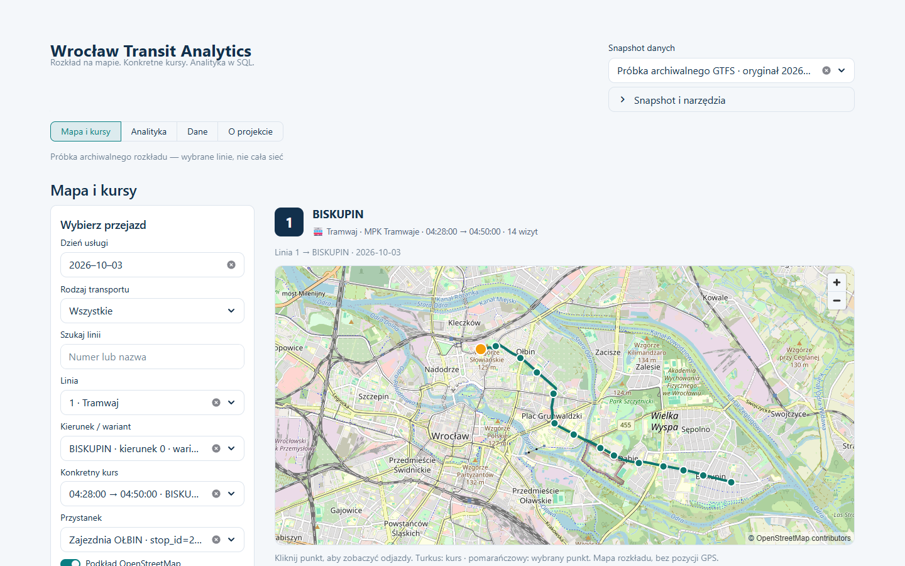

# Wrocław Transit Analytics

Lokalna mapa rozkładowych kursów Wrocławia i analityka GTFS w PostgreSQL. Interfejs jest po polsku; opis projektu, kodu i testów znajdziesz w [głównym README](README.md).



## Uruchomienie po pobraniu ZIP-a

1. [Pobierz publiczny ZIP gałęzi portfolio](https://github.com/playson92/wroclaw-transit-analytics/archive/refs/heads/feat/portfolio-polish.zip) i rozpakuj. Nie potrzebujesz konta GitHub ani Gita.
2. Uruchom lokalny Docker Desktop z silnikiem Linux albo Linux Docker Engine. Wymagane Docker Engine 24+ i Compose 2.20+; na komputerze autora sprawdzono Docker 29.8.1 / Compose 5.5.1. Pierwszy build pobiera obrazy i pakiety z internetu.
3. W terminalu, z katalogu repozytorium, wykonaj:

```text
docker compose -f compose.demo.yaml up --build -d --wait
```

Po sukcesie otwórz **[http://127.0.0.1:8504](http://127.0.0.1:8504)**. Nie trzeba lokalnego Pythona, PostgreSQL, `.env`, haseł, kluczy API ani przygotowanych danych. Compose tworzy własne trwałe wolumeny i losowe poświadczenia; nie publikuje portu bazy.

Zatrzymanie bez utraty danych:

```text
docker compose -f compose.demo.yaml stop
```

Ponowny start: ta sama pierwsza komenda, z zachowaniem kolejności etapów. Restart wyłącznie działającej bazy i strony: `docker compose -f compose.demo.yaml restart postgres dashboard`, następnie `docker compose -f compose.demo.yaml up -d --wait`, aby poczekać na gotowość. Nie restartuj jednorazowych etapów poza ich zależnościami. Hasła i dane zostają zachowane. Nie używaj `down -v` ani `prune` do restartu.

Jeśli 8504 jest zajęty, ustaw w PowerShell `$env:WTA_DEMO_PORT = '8514'` i wykonaj tę samą komendę; otwórz wtedy `http://127.0.0.1:8514`. Dla innych terminali zobacz [przykłady](README.md#quick-start-from-a-fresh-download).

## Co zobaczysz

**Mapa i kursy | Analityka | Dane | O projekcie.** Wybierz dzień, linię, kierunek i kurs. Kliknij przystanek na mapie albo wybierz go z listy. Lista kursu zachowuje każdą wizytę; odjazdy pokazują źródłowe godziny i zasady wsiadania. [Krótkie nagranie działającej aplikacji](docs/assets/portfolio-demo.webm).

To **„Próbka archiwalnego rozkładu — wybrane linie, nie cała sieć”**: pochodny zestaw prawdziwych danych pobranych 2026-10-04, z kalendarzem 2026-10-03–2026-10-18. Linie tramwajowe **1 i 10**, autobusowe **100 i 106**. KPI obejmują tylko próbkę. Nie jest to aktualny rozkład ani oficjalna aplikacja miasta. Mapa przedstawia rozkładową geometrię, nie GPS. Eksperymentalne obserwacje CUI są domyślnie wyłączone. [Pochodzenie i hashe](src/wroclaw_transit_analytics/portfolio/assets/manifest.json).

Rozkład i geometria są lokalne; podstawowe demo nie pobiera miejskiego API. Opcjonalny podkład OpenStreetMap wymaga sieci. Bez niego nadal działają kursy, punkty i tabele. Nie dołączamy kafelków OSM do paczki.

Demo ma osobny projekt `wta-portfolio`; wcześniejsze aplikacje na 8501/8502 nie należą do niego. Pełny GTFS oraz zachowane startery opisuje [przeglądarka i import](docs/transit-explorer.md). Syntetyczne D1/D2 pozostaje osobną fixture: **16 / 25 / 2 / 3** dla 2026-10-01–2026-10-07.

[Macierz rzeczywiście sprawdzonych platform](README.md#requirements-and-platform-evidence), [ścieżka po kodzie i testy](README.md#code-tour-and-tests). Brak fizycznego środowiska macOS oznacza brak testu macOS; wynik Linux ARM64 go nie zastępuje.

Autor: **Jonatan Tomaszewicz**. Kod: [MIT](LICENSE). GTFS: CC0 1.0 według [oficjalnych metadanych](https://open-data.cui.wroclaw.pl/hdb/metadane/13/) sprawdzonych 2026-10-10. Mapa: [OpenStreetMap](https://www.openstreetmap.org/copyright) / [zasady kafelków](https://operations.osmfoundation.org/policies/tiles/).
