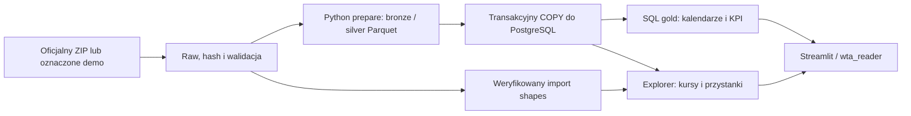

# Wrocław Transit Analytics — studium projektu 0.2.0

Problem: statyczny GTFS ma miliony wizyt przystanków, lecz sam katalog trips nie mówi,
ile kursów jest aktywnych w wybranym dniu ani którędy jedzie konkretny wariant.
Projekt zamienia jawny ZIP w sprawdzalne dane SQL i lokalny ekran rozkładu:
mapę, linie, kursy, odjazdy oraz analitykę. Nie mierzy realizacji przewozu ani popytu.


To ekran aktualnej aplikacji na historycznym GTFS i rzeczywistym podkładzie OSM.
Syntetyczny raster używany w testach technicznych nie jest tym obrazem.

## Przepływ i decyzje techniczne



Raw zachowuje bajty. Python waliduje klucze, referencje i czasy oraz publikuje
Parquet i manifest jakości. PyArrow oraz strumieniowy COPY ograniczają pamięć.
Dataset identyfikuje hash ZIP-a i model; analiza — dataset, jawne daty oraz wersja KPI.
Append-only loader i analityka mają blokady, transakcje i idempotencję, bez zastępowania
innych snapshotów. Granice publikacji plików i danych w bazie są osobne.

SQL rozwija calendar i calendar_dates przed agregacją. Kurs to trip_id w dniu usługi,
a odjazd to konkretna wizyta z pickup_type=0 i znaną departure_seconds.
Nie sumujemy dziennych DISTINCT linii ani nie uśredniamy median/p90.
Brak pokrycia i brak czasu pozostają NULL. Godziny 24:10 czy 25:10 zachowują dzień
usługowy, bez modulo 24 i pozornych timestampów UTC.

Explorer czyta aktywne linie, warianty z uporządkowanym ciągiem przystanków i wybrany kurs.
Shapes są weryfikowane względem źródłowego hasha i datasetu; nie powstają proste trasy
udające ulice, gdy geometria jest nieobecna. Każda powtarzana wizyta stop_id pozostaje
w tabeli kursu. Tabela odjazdów oznacza źródłowy timepoint jako dokładny/przybliżony.

PostgreSQL 17 zapewnia FK, transakcje i NULLS NOT DISTINCT. Dashboard ma rzeczywistą
rolę `wta_reader` bez zapisu; explorer udostępnia tylko potrzebne widoki silver.
Każdy SELECT jest w krótkiej transakcji READ ONLY. Compose publikuje 127.0.0.1
i uruchamia aplikację jako UID 10001. [Cienki starter](transit-explorer.md) wykorzystuje
istniejący pipeline, zachowuje hasła i wolumeny oraz rozróżnia restart, demo i jawne GTFS.

## Pięć odtwarzalnych wniosków SQL

Poniższe wyniki odczytano ponownie z istniejącej bazy dla archiwum pobranego
**2026-10-04T21:11:22.391308Z** z oficjalnego `/hdb/download/141/`.
SHA-256 źródła: `11fccf1a82e170bb2fe3c77c81cfdb6434158e143064b38ff23a3a5888e56f01`.
Zakres analizy to **2026-10-03–2026-10-09**, `wta-gold-v1`; kalendarz źródła obejmuje
2026-10-03–2026-10-18. Wyniki dotyczą tego snapshotu, nie dzisiejszego ruchu.

Odtworzenie w `psql` na bazie, w której ten konkretny snapshot i analiza są załadowane:

```sql
SELECT a.dataset_id, a.analysis_id
FROM meta.analyses a
JOIN meta.datasets d USING (dataset_id)
WHERE d.source_sha256 = '11fccf1a82e170bb2fe3c77c81cfdb6434158e143064b38ff23a3a5888e56f01'
  AND d.model_version = 'wta-silver-v1'
  AND a.metrics_version = 'wta-gold-v1'
  AND a.start_date = DATE '2026-10-03'
  AND a.end_date = DATE '2026-10-09'
  AND a.status = 'complete'
\gset
```

Brak wyniku oznacza brak tej analizy; nie zastępujemy jej automatycznie „najnowszą”.
Po ustawieniu tych zmiennych uruchom zapytania poniżej.

**1. W siedmiu dniach jest 81 292 dziennych instancji kursów.**
Dzienne liczby to 8 590, 8 284, 12 883, 12 883, 12 883, 12 883 i 12 886.
To liczba rozkładowych instancji, a nie statycznych szablonów trips.

```sql
SELECT service_date, trip_instances
FROM gold.analysis_days
WHERE analysis_id = :'analysis_id' AND dataset_id = :'dataset_id'
ORDER BY service_date;
```

**2. Znanych regularnych odjazdów jest 1 720 094 z 2 202 284 wszystkich wizyt.**
84 008 wizyt ma zakaz wsiadania, a 398 182 — wsiadanie na żądanie.
W tej analizie brakujące odjazdy i przybliżone regularne odjazdy mają licznik 0.
Zgodne mianowniki nie dowodzą rzeczywistego wykonania kursów ani jakości innego feedu.

```sql
SELECT sum(total_events) AS visits,
       sum(regular_known_departures) AS regular_departures,
       sum(no_pickup_events) AS no_pickup,
       sum(on_request_events) AS on_request,
       sum(missing_departures) AS missing_departures,
       sum(approximate_regular_departures) AS approximate_regular_departures
FROM gold.coverage_daily
WHERE analysis_id = :'analysis_id' AND dataset_id = :'dataset_id';
```

**3. W całym okresie aktywne są 137 route_id i obsługiwane 2 486 stop_id.**
DISTINCT jest liczony w całym okresie; nie podwaja linii kursujących w kolejnym dniu.
To identyfikatory punktów z GTFS, bez scalania przystanków o podobnych nazwach.

```sql
SELECT
  (SELECT count(DISTINCT route_id) FROM gold.route_daily
   WHERE analysis_id = :'analysis_id' AND dataset_id = :'dataset_id'
     AND trip_count > 0) AS active_routes,
  (SELECT count(DISTINCT stop_id) FROM gold.service_span
   WHERE analysis_id = :'analysis_id' AND dataset_id = :'dataset_id') AS served_stops;
```

**4. Najwięcej rozkładowych instancji mają linie N: 1 305, 715: 1 292 i 115: 1 288.**
Ranking mówi o liczbie kursów w tym zakresie. Nie jest rankingiem liczby pasażerów,
punktualności ani jakości obsługi.

```sql
SELECT r.route_id, c.route_short_name, sum(r.trip_count) AS trips
FROM gold.route_daily r
JOIN gold.route_catalog c USING (dataset_id, route_id)
WHERE r.analysis_id = :'analysis_id' AND r.dataset_id = :'dataset_id'
GROUP BY r.route_id, c.route_short_name
ORDER BY trips DESC, r.route_id
LIMIT 3;
```

**5. Zaimportowane shapes mają 363 002 punkty w 1 160 identyfikatorach geometrii.**
Geometria pozwala pokazać przebieg konkretnego kursu. Punkty shapes nie są kolejnymi
pomiarami pozycji pojazdu.

```sql
SELECT count(*) AS points, count(DISTINCT shape_id) AS shapes
FROM explorer.shape_points
WHERE dataset_id = :'dataset_id';
```

Demo jest osobnym przykładem programu: analiza 2026-10-01–2026-10-07 ma
**16 kursów / 25 regularnych znanych odjazdów / 2 linie / 3 punkty**.
Kalendarz generatora obejmuje 2026-10-01–2026-10-31; zakres analizy nie jest całym kalendarzem.
Filtr D1/0001 → D2/0001 → D2/NA zmienia pierwszy znany czas z 08:00 na 23:50 i 24:10.
Te liczby nie opisują komunikacji Wrocławia.

## Testy, błędy i odbiór

Offline testuje kontrakty, manifesty, jakość i AppTest. Prawdziwy PostgreSQL sprawdza
wartości, izolację, ACL, rollback, upgrade i idempotencję. Compose/Chromium uruchamia
rzeczywisty Streamlit i bazę także po restarcie. Obowiązkowa regresja używa dwóch
syntetycznych snapshotów o rozłącznych kalendarzach; sprawdza datę widoczną w przeglądarce,
kursy, kolejną interakcję, przejście między widokami i reload. Brak fixture powoduje błąd.

Raster ma osobny test z własnym PNG, kontrolą pikseli i kliknięciem znacznika.
Awaria/wyłączenie podkładu zachowuje własną geometrię i tabele. Lokalny rzeczywisty
snapshot i ulice wymagają osobnego odbioru: zielony test syntetyczny go nie zastępuje.
Windows Docker Desktop, mniejsze okno, świeży checkout, restart i zgodność kodu
kontenera z pakietem mają dowody w końcowym raporcie. JUnit i wyniki CI odnoszą się
do konkretnych testowanych SHA; historii nie dolicza się do nowej sumy.

Wcześniejsze ekrany analityki pozostają jawnie historyczne:
[demo-browser.json](screenshots/demo-browser.json), CI
[37676750597](https://github.com/playson92/wroclaw-transit-analytics/actions/runs/37676750597),
commit `6bdff963213f9cec3b7504de91c00aced07cffc6`; oficjalny snapshot:
[real-browser.json](screenshots/real-browser.json), CI
[37678301811](https://github.com/playson92/wroclaw-transit-analytics/actions/runs/37678301811),
commit `3d13234cd73948cdba3f4e73e658dc92baa1941f`.
Ich wyniki 2026-10-07–08 i ówczesny Windows NOT_RUN opisują tamte runy, nie obecne wydanie.
[Historyczny błąd daty](explorer-review-closeout.md) również zachowano jako reprodukcję.

## Granice i warunki użycia

Brakujące czasy nie są interpolowane; grupy headway mogą łączyć warianty tej samej linii.
Frequencies/flex, punktualność, pasażerowie, predykcje, chmura i planer przesiadek
pozostają poza wydaniem. Snapshot jest archiwalny, bez obietnicy aktualnego rozkładu.

Live GPS nie jest ukończoną funkcją. Eksperymentalne CUI jest domyślnie wyłączone,
szare i oddzielne od GTFS. Niepotwierdzona strefa czasu i warunki źródła nie pozwalają
przedstawiać obserwacji jako pozycji „teraz” ani łączyć ich z trip_id.

Licencje są odrębne: [kod MIT](../LICENSE); GTFS — CC0 1.0 według
[oficjalnych metadanych](https://open-data.cui.wroclaw.pl/hdb/metadane/13/)
odczytanych 2026-10-07; mapa — [atrybucja OSM](https://www.openstreetmap.org/copyright)
i [Tile Usage Policy](https://operations.osmfoundation.org/policies/tiles/).
Metadane GTFS nie potwierdzają warunków obserwacji pozycji CUI.
