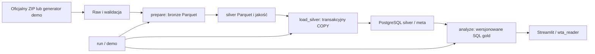
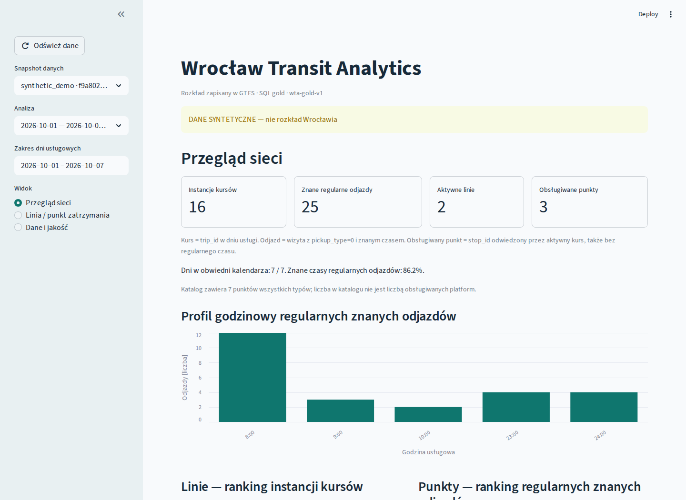
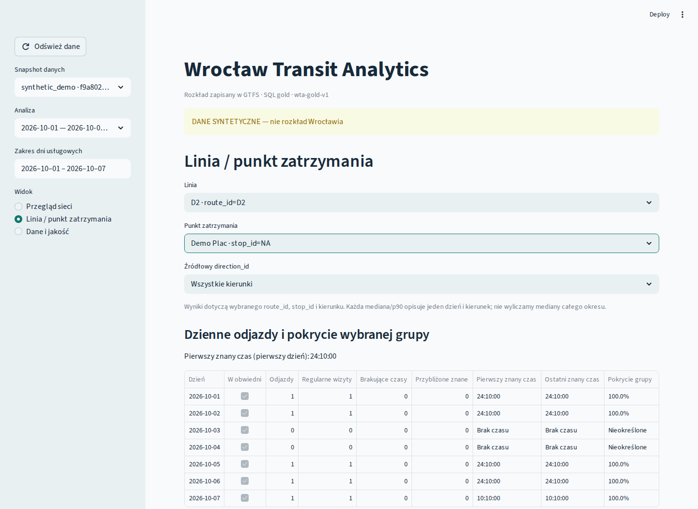
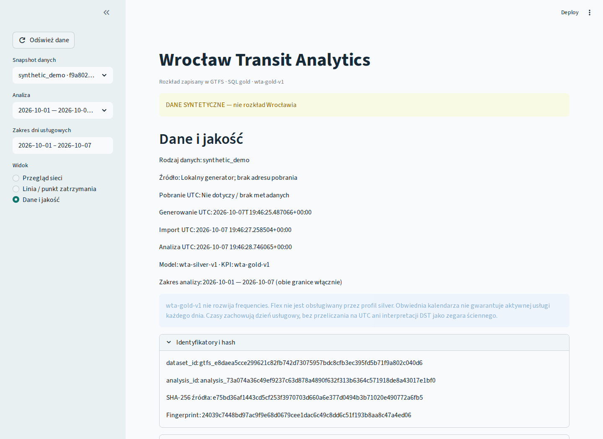

# Wrocław Transit Analytics — studium projektu

Projekt pozwala odtwarzalnie badać deklarowany rozkład GTFS: aktywne usługi w konkretnych
dniach, kursy i znane odjazdy oraz braki informacji o czasie. Nie mierzy punktualności ani popytu.

Raw zachowuje bajty; silver zachowuje tekstowe ID i BIGINT czasu. Dataset identyfikuje
hash ZIP-a i model, a analiza dataset, daty i wersję KPI. Append-only loader i analityka
serializują tożsamości i nie podwajają wyników. Pliki i baza mają osobne granice publikacji.

Kurs to trip_id w dniu usługi; odjazd to wizyta z pickup_type=0 i znaną departure_seconds.
Headway jest odstępem między wizytami w jednej dziennej grupie linia/punkt/kierunek.
SQL definiuje KPI; UI czyta gold. Nie sumuje dziennych DISTINCT ani nie uśrednia median/p90.
NULL kierunku i brak pokrycia są informacją. Obwiednia nie gwarantuje kursu każdego dnia.

Parquet i strumieniowy COPY ograniczają pamięć. PostgreSQL 17 zapewnia transakcje, FK
i NULLS NOT DISTINCT. Czasy zachowują dzień usługowy, także 25:10, bez pozornego DST/UTC.
Streamlit jest opcjonalny. Reader ma rzeczywiste ACL bez praw zapisu; UI ma krótkie
transakcje READ ONLY. Compose publikuje tylko 127.0.0.1 i uruchamia pakiet jako UID 10001.
Demo ma własną konfigurację i trwałe wolumeny, bez rotacji haseł przy powtórzeniu.

Testy obejmują kontrakty, AppTest, ręczne scenariusze, prawdziwą bazę, upgrade, idempotencję,
izolację, rollback i przeglądarkę po restarcie. JUnit i dowody konkretnych SHA są w review bundle.

## Wnioski z wykonanych SELECT

Oficjalny snapshot pobrany z `/hdb/download/141/` 7 października 2026,
SHA-256 `11fccf1a82e170bb2fe3c77c81cfdb6434158e143064b38ff23a3a5888e56f01`,
dataset `gtfs_00a11db35a3dff8c854a5bdba9ee73842ff795561a9a50480119e7d6fb799546`,
analiza `analysis_b07c0d87aa644479083db4434778dced55cf8804ce4a9d1c3ac4bada9ebb503d`,
zakres 2026-10-07…2026-10-08. Zapytania i pełne liczniki są w `real-smoke.json`:

1. Dwa pokryte dni miały po 12 883 instancje kursów, razem 25 766. To instancje dzienne,
   nie 42 643 statyczne szablony trips ze źródła.
2. W tym zakresie gold zawiera 541 284 znane regularne odjazdy oraz 693 712 wszystkich
   wizyt stop_times. Wykluczone pickup to 26 688 wizyt bez wsiadania i 125 740 na żądanie.
3. Aktywne były 136 różnych route_id z katalogu 137 linii. DISTINCT całego zakresu nie
   podwaja linii występujących w obu dniach. Obsługiwane były 2 484 stop_id; katalog liczy 2 486.
4. Najwięcej instancji w rankingu route_id miała linia 715: 424, następnie 115: 420.
   To ranking liczby rozkładowych kursów, bez wniosków o pasażerach lub jakości obsługi.
5. W obu dniach nie było brakujących czasów. 100% dotyczy zgodnych mianowników tej analizy,
   nie dowodzi poprawności całego GTFS ani rzeczywistej realizacji rozkładu.

Demo służy sprawdzaniu programu: w jawnych 7 dniach ma 16 instancji i 25 znanych regularnych
odjazdów. Zmiana filtra D1/0001 → D2/0001 → D2/NA zmienia pierwszy znany czas z 08:00
na 23:50 i 24:10. To przykład syntetyczny, nie obserwacja komunikacji Wrocławia.

Ograniczenia: frequencies/flex, realtime, pasażerowie, shapes na mapie i chmura.
Warianty linii mogą dzielić grupę headway. Brakujące czasy nie są interpolowane.
Benchmark syntetyczny nie dowodzi wydajności dowolnego feedu. Linux CI nie jest dowodem
pełnego działania Docker Desktop na Windowsie; raport oddziela środowiska.

Kod: MIT. Oficjalne metadane danych: CC0 1.0
([OpenData Wrocław, odczyt 7 października 2026](https://open-data.cui.wroclaw.pl/hdb/metadane/13/)).
Warunki danych są odrębne od licencji kodu. Demo ma lokalne pochodzenie i nie reprezentuje
miejskiego rozkładu; nie podajemy fikcyjnego adresu pobrania.

## Rzeczywiste ekrany demo

Chromium i rzeczywisty Streamlit/PostgreSQL w CI
[37676750597](https://github.com/playson92/wroclaw-transit-analytics/actions/runs/37676750597),
commit `6bdff963213f9cec3b7504de91c00aced07cffc6`. Pełne identyfikatory i filtry:
[demo-browser.json](screenshots/demo-browser.json). Zakres 2026-10-01…2026-10-07;
widok szczegółowy: D2 / NA / wszystkie kierunki. Odświeżenie, reload i drugi test
po restarcie zachowały wyniki. To działająca aplikacja z syntetycznym GTFS.

