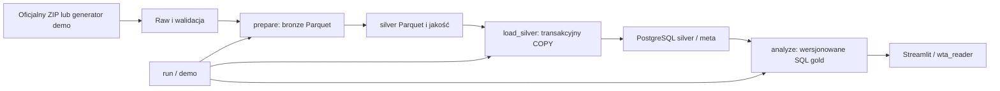

# Wrocław Transit Analytics — studium projektu

Projekt pozwala odtwarzalnie badać deklarowany rozkład GTFS: aktywne usługi w konkretnych
dniach, kursy i znane odjazdy oraz braki informacji o czasie. Nie mierzy punktualności ani popytu.

Raw zachowuje bajty; silver zachowuje tekstowe ID i BIGINT czasu. Dataset identyfikuje
hash ZIP-a i model, a analiza dataset, daty i wersję KPI. Append-only loader i analityka
serializują tożsamości i nie podwajają wyników. Pliki i baza mają osobne granice publikacji.

Kurs to trip_id w dniu usługi; odjazd to wizyta z pickup_type=0 i znaną departure_seconds.
Headway jest odstępem między wizytami w jednej dziennej grupie linia/punkt/kierunek.
SQL definiuje KPI; UI czyta gold. Nie sumuje dziennych DISTINCT ani nie uśrednia median/p90.
NULL kierunku i brak pokrycia są informacją. Obwiednia nie gwarantuje kursu każdego dnia.

Parquet i strumieniowy COPY ograniczają pamięć. PostgreSQL 17 zapewnia transakcje, FK
i NULLS NOT DISTINCT. Czasy zachowują dzień usługowy, także 25:10, bez pozornego DST/UTC.
Streamlit jest opcjonalny. Reader ma rzeczywiste ACL bez praw zapisu; UI ma krótkie
transakcje READ ONLY. Compose publikuje tylko 127.0.0.1 i uruchamia pakiet jako UID 10001.
Demo ma własną konfigurację i trwałe wolumeny, bez rotacji haseł przy powtórzeniu.

Testy obejmują kontrakty, AppTest, ręczne scenariusze, prawdziwą bazę, upgrade, idempotencję,
izolację, rollback i przeglądarkę po restarcie. Faktyczne SELECT i screenshoty będą dopisane
po wykonaniu CI, wraz z SHA i filtrami.

Ograniczenia: frequencies/flex, realtime, pasażerowie, shapes na mapie i chmura.
Warianty linii mogą dzielić grupę headway. Brakujące czasy nie są interpolowane.
Benchmark syntetyczny nie dowodzi wydajności dowolnego feedu. Linux CI nie jest dowodem
pełnego działania Docker Desktop na Windowsie; raport oddziela środowiska.

Kod: MIT. Oficjalne metadane danych: CC0 1.0
([OpenData Wrocław, odczyt 7 października 2026](https://open-data.cui.wroclaw.pl/hdb/metadane/13/)).
Warunki danych są odrębne od licencji kodu. Demo ma lokalne pochodzenie i nie reprezentuje
miejskiego rozkładu; nie podajemy fikcyjnego adresu pobrania.
